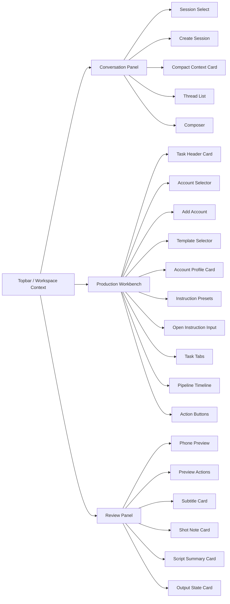
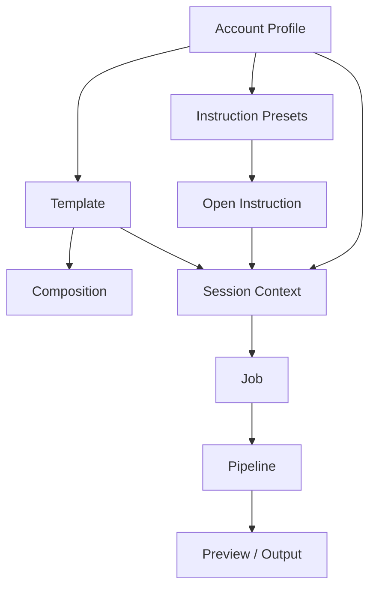
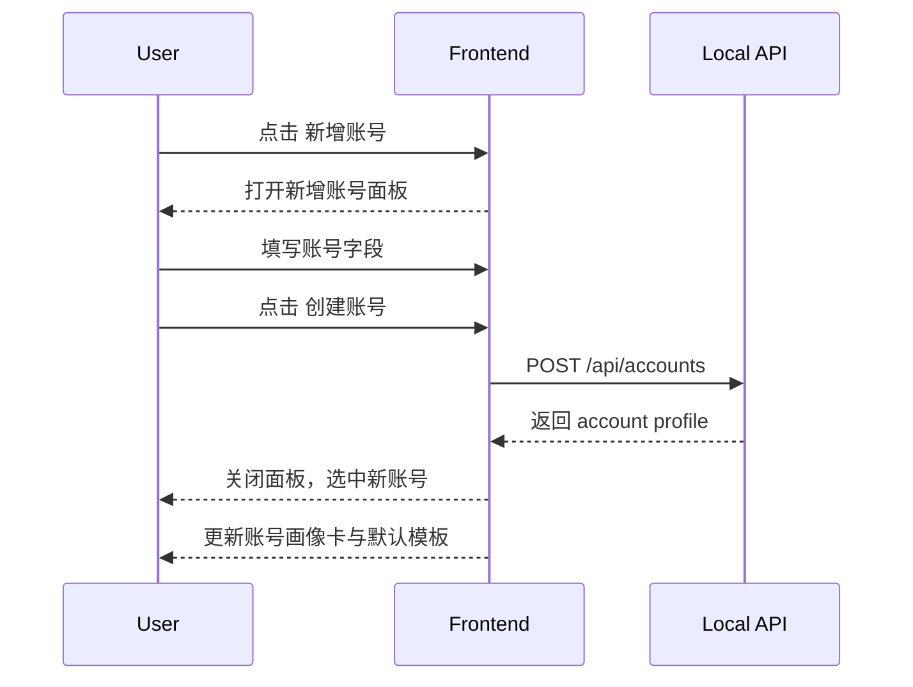
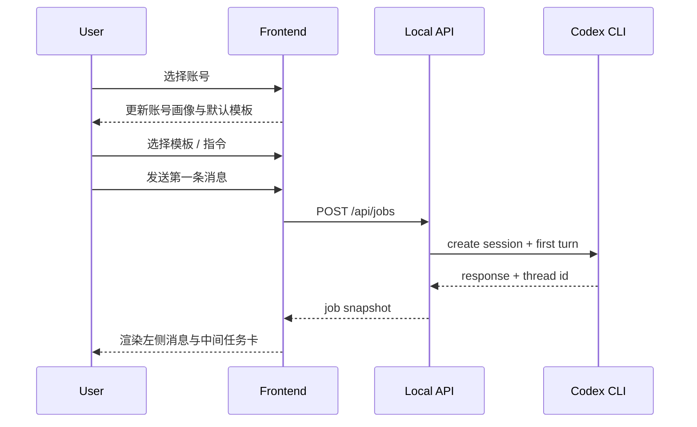

# Codex Video Console Wireframes and Interaction Diagrams

This document supports `FRONTEND_FUNCTIONAL_DESIGN.md`.

It focuses on:

- structure
- layout
- module boundaries
- primary user flows

## 1. Product Structure Diagram



## 2. Core Object Relationship Diagram



## 3. Desktop Main Screen Wireframe

```text
┌───────────────────────────────────────────────────────────────────────────────────────────────────────────────┐
│ Topbar                                                                                                        │
│ [Logo] Codex Video Console   D:\program\ai_video\workflow   [Session Chip] [Job Chip] [Output Chip] [R][S] │
├───────────────────────────────┬────────────────────────────────────────────────────────────┬──────────────────┤
│ Left / Conversation           │ Center / Production Workbench                              │ Right / Review    │
│                               │                                                            │                  │
│ 视频任务对话             [CLI] │ 假突破交易教育视频                                          │ 审阅与预览         │
│                               │                                                            │                  │
│ [Session ▼] [新建]            │ ┌────────────────────────────────────────────────────────┐ │  ┌──────────────┐ │
│                               │ │ Task Header Card                                       │ │  │ Phone Frame  │ │
│ ┌───────────────────────────┐ │ │ 账号 [交易教育-小红书 ▼] [新增账号]                     │ │  │ preview      │ │
│ │ 当前账号: 交易教育-小红书 │ │ │ 模板 [new_signals ▼]  Composition [NewSignals...]     │ │  │ title        │ │
│ │ 当前模板: new_signals     │ │ │ 锁定模板 [on]   [小红书] [60s] [9:16]                 │ │  │ subtitle     │ │
│ │ 输出目录: data/jobs/...   │ │ └────────────────────────────────────────────────────────┘ │  └──────────────┘ │
│ └───────────────────────────┘ │                                                            │  [预览][目录][导出]│
│                               │ ┌────────────────────────────────────────────────────────┐ │                  │
│ ┌───────────────────────────┐ │ │ Account Profile Card                                   │ │  当前字幕         │
│ │ assistant bubble          │ │ │ 平台: 小红书                                          │ │  镜头说明         │
│ │ user bubble               │ │ │ 人设: 冷静交易老师                                    │ │  脚本摘要         │
│ │ long bubble -> inner      │ │ │ 风格: 强Hook / 更口语化 / 节奏快                      │ │  产物状态         │
│ │ scroll                    │ │ │ CTA: 行动建议型                                      │ │                  │
│ │                            │ │ │ 禁止项: 不喊单 / 不夸收益                            │ │                  │
│ └───────────────────────────┘ │ └────────────────────────────────────────────────────────┘ │                  │
│                               │                                                            │                  │
│ [ textarea                ]   │ ┌────────────────────────────────────────────────────────┐ │                  │
│ [素材]                [发送]  │ │ Instruction Area                                       │ │                  │
│                               │ │ [强化 Hook] [小红书风格] [更口语化] [只重写文案] ...   │ │                  │
│                               │ │ 开放指令 [__________________________________________] │ │                  │
│                               │ │ [仅本轮] [持续作用于当前 session]                      │ │                  │
│                               │ └────────────────────────────────────────────────────────┘ │                  │
│                               │                                                            │                  │
│                               │ [任务流] [脚本] [字幕] [资源] [日志]                      │                  │
│                               │                                                            │                  │
│                               │ 01 解析需求                     [done]                    │                  │
│                               │ 02 生成 video_plan.json        [running]                 │                  │
│                               │ 03 生成脚本与字幕结构           [waiting]                 │                  │
│                               │ 04 生成 TTS 与时间轴           [waiting]                 │                  │
│                               │ 05 绑定 Composition            [waiting]                 │                  │
│                               │ 06 渲染 MP4                    [waiting]                 │                  │
│                               │                                                            │                  │
│                               │ [生成计划] [配音] [渲染]                                  │                  │
└───────────────────────────────┴────────────────────────────────────────────────────────────┴──────────────────┘
```

## 4. Add Account Panel Wireframe

```text
┌──────────────────────────────────────────────┐
│ 新增账号                                 [X] │
├──────────────────────────────────────────────┤
│ 账号名称                                    │
│ [ 交易教育-小红书                     ]     │
│                                              │
│ 平台                                        │
│ [ 小红书 ▼ ]                                 │
│                                              │
│ 人设                                        │
│ [ 冷静交易老师                         ]     │
│                                              │
│ 风格标签                                    │
│ [ 强Hook ] [ 更口语化 ] [ 节奏快 ] [+]       │
│                                              │
│ 默认模板                                    │
│ [ new_signals ▼ ]                            │
│                                              │
│ 默认时长                                    │
│ [ 60 秒 ]                                    │
│                                              │
│ CTA 风格                                    │
│ [ 行动建议型 ▼ ]                              │
│                                              │
│ 禁止项                                      │
│ [ 不喊单，不夸收益，不做收益承诺         ]   │
│                                              │
├──────────────────────────────────────────────┤
│                          [取消] [创建账号]   │
└──────────────────────────────────────────────┘
```

## 5. Session and Chat Detail Wireframe

```text
┌──────────────────────────────────────────────┐
│ 视频任务对话                           [CLI] │
├──────────────────────────────────────────────┤
│ [Session ▼] [新建]                           │
│                                              │
│ 当前账号: 交易教育-小红书                    │
│ 当前模板: new_signals                        │
│ 输出目录: data/jobs/job_xxx                  │
├──────────────────────────────────────────────┤
│ assistant                                    │
│ ┌──────────────────────────────────────────┐ │
│ │ 这条视频我会先按当前账号风格做出 Hook。 │ │
│ └──────────────────────────────────────────┘ │
│                                              │
│ you                                          │
│ ┌──────────────────────────────────────────┐ │
│ │ 做一个 60 秒的假突破视频，节奏要快。    │ │
│ └──────────────────────────────────────────┘ │
│                                              │
│ assistant                                    │
│ ┌──────────────────────────────────────────┐ │
│ │ 很长的回答...                            │ │
│ │ ...内部滚动...                            │ │
│ └──────────────────────────────────────────┘ │
├──────────────────────────────────────────────┤
│ [ 输入这条视频的目标、风格、约束         ]   │
│ [素材]                                [发送] │
└──────────────────────────────────────────────┘
```

## 6. Workbench Module Breakdown

```mermaid
flowchart TD
    A["Task Header Card"] --> A1["Account Selector"]
    A --> A2["Add Account Trigger"]
    A --> A3["Template Selector"]
    A --> A4["Composition Display"]
    A --> A5["Template Lock"]
    A --> A6["Platform / Duration / Ratio Chips"]

    B["Account Profile Card"] --> B1["Platform"]
    B --> B2["Persona"]
    B --> B3["Tone Tags"]
    B --> B4["CTA Style"]
    B --> B5["Constraints"]

    C["Instruction Area"] --> C1["Preset Chips"]
    C --> C2["Open Instruction Textarea"]
    C --> C3["Scope Toggle"]

    D["Task Tabs"] --> D1["Workflow"]
    D --> D2["Script"]
    D --> D3["Subtitles"]
    D --> D4["Resources"]
    D --> D5["Logs"]
```



## 7. Review Panel Wireframe

```text
┌──────────────────────────────────────┐
│ 审阅与预览                     [Ready]│
├──────────────────────────────────────┤
│            ┌──────────────┐          │
│            │  phone mock  │          │
│            │  title       │          │
│            │  subtitle    │          │
│            │  progress    │          │
│            └──────────────┘          │
│                                      │
│ [预览] [目录] [导出]                  │
│                                      │
│ 当前字幕                              │
│ 先等回踩确认，再判断量能是否跟上。     │
│                                      │
│ 镜头说明                              │
│ K线图表 + 高亮字幕 + 节奏快切。        │
│                                      │
│ 脚本摘要                              │
│ Hook / Body / Close                  │
│                                      │
│ 产物状态                              │
│ MP4 ready / cover ready / log ok     │
└──────────────────────────────────────┘
```

## 8. Create Account Interaction Sequence



## 9. Start New Video Flow



## 10. Layout Notes

### 10.1 Left Column

The left column should stay focused on chat.

Do not reintroduce a large session management list into the main chat flow unless it is hidden in a drawer or secondary panel.

### 10.2 Center Column

The center column is the primary operating surface.

It should contain the most important controls:

- account
- add account
- template
- instructions
- pipeline

### 10.3 Right Column

The right column is for review, not decoration.

Every card there should help the user judge whether the current result is acceptable.

## 11. Future Optional Views

Later the frontend can add:

- dedicated account management page
- template gallery page
- batch job page
- output library page

But they are not required for the current workbench V2.
